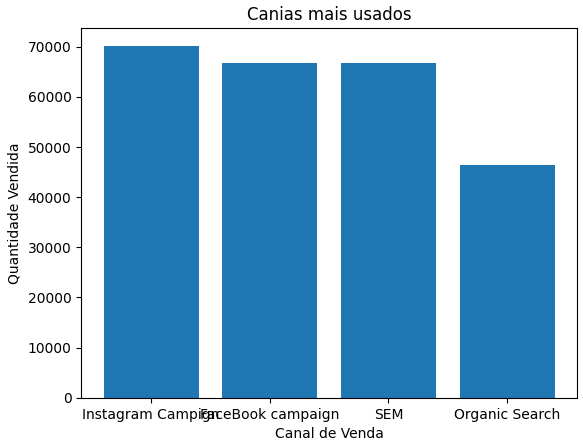

# Desafio ecommerce - Itau

Este desafio foi feito com base em conhecimentos e materiais de estudo da linguagem Python adquiridos através de cursos profissionalizantes.

---

# Sobre

Esta aplicação limpa, organiza, consulta e exibe dados de um ecommerce.

##### Objetivo:
O objetivo foi transformar dados brutos em insights claros, que identifiquem padrões, categorias e comportamentos, respondendo a todas as questões com clareza.

---

# Tecnologias e Ferramentas
- **Python**  
- **Pandas** e **Matplotlib**  
- **Google Colab**
  
Python foi utilizado para manipulação de dados e desenvolvimento das análises, com suporte da biblioteca Pandas para organização e limpeza das tabelas e Matplotlib/Seaborn para criação de gráficos e visualizações. O projeto foi desenvolvido no ambiente interativo do Google Colab, permitindo execução direta do código e análise dos resultados.

--- 

# Análise e conclusão dos gráficos

---
Os produtos da categoria Books, foram os mais vendidos nos últimos 3 anos, o que mostra que é uma categoria boa e muito procurada pelos clientes.

---
Embora todas as categorias tenham produtos com preços elevados, a categoria Eletronics se destaca, levando em consideração também que esta é a categoria que atrai pessoas dispostas a gastar mais

---
Com base nos gráficos, também é possivel concluir que os NPS variam bastante em todas as categorias.

---
Em quantidade, conseguimos ver que a categoria home lidera, vendendo em quantidades maiores se comparados com outras categorias, apesar de também terem bons números

---
O canal mais usado é Instagram Campaign, apesar de estar no topo, os outros canais de venda não ficam muito para trás, exceto pelo Organic Search, que tem números menores se comparado com os outros

---
A quantidade de vendas por canais segue o mesmo padrão do canal mais usado, sendo, Instagram campaign o topo.

---

*Agradeço pela oportunidade, pela experiência e pelo aprendizado neste desafio*
**Rafael Pastor Menezes**
